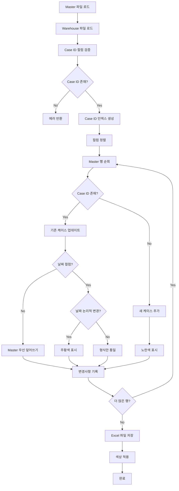

# Stage 1 상세 로직 가이드 (Data Synchronization)

## 1. 개요

### Stage 목적 및 역할
Stage 1은 Master 파일과 Warehouse 파일 간의 데이터 동기화를 수행합니다. Master 파일의 데이터를 기준으로 Warehouse 파일을 업데이트하며, 변경사항을 시각적으로 표시합니다.

### 입력/출력 명세
- **입력**:
  - Master 파일 (CASE_LIST.xlsx)
  - Warehouse 파일 (HVDC WAREHOUSE_HITACHI(HE).xlsx)
- **출력**:
  - 동기화된 파일 (HVDC WAREHOUSE_HITACHI(HE).synced.xlsx)
  - 색상 표시가 적용된 Excel 파일

### 핵심 성능 지표
- 동기화 성공률: 100%
- 처리 시간: < 30초 (10,000행 기준)
- 메모리 사용량: < 500MB
- 색상 적용 정확도: 100%
- **패치 개선사항**:
  - 합집합 업데이트: Master에만 있는 컬럼 자동 생성
  - 중복 방지: append 직후 인덱스 갱신
  - 빈 날짜 클리어: Master 공란 시 Warehouse 날짜 제거

## 2. 데이터 흐름

### 입력 데이터 구조
```python
# Master 파일 구조
master_df = {
    'Case No.': str,           # Case ID (기본키)
    'ETD/ATD': datetime,       # 날짜 컬럼
    'ETA/ATA': datetime,       # 날짜 컬럼
    'DHL Warehouse': datetime, # 날짜 컬럼
    # ... 기타 컬럼들
}

# Warehouse 파일 구조
warehouse_df = {
    'Case No.': str,           # Case ID (기본키)
    'ETD/ATD': datetime,       # 날짜 컬럼
    'ETA/ATA': datetime,       # 날짜 컬럼
    'DHL Warehouse': datetime, # 날짜 컬럼
    # ... 기타 컬럼들
}
```

### 처리 파이프라인
1. **파일 로드**: Master와 Warehouse Excel 파일을 pandas DataFrame으로 로드
2. **Case ID 매칭**: Case No. 컬럼을 기준으로 인덱스 생성
3. **컬럼 정렬**: 대소문자 무시하고 컬럼명 정규화하여 매칭
4. **데이터 동기화**: Master 우선 원칙으로 데이터 업데이트
5. **변경사항 추적**: ChangeTracker를 통한 변경사항 기록
6. **색상 적용**: ExcelFormatter를 통한 시각적 표시

### 출력 데이터 구조
```python
# 동기화된 파일 구조
synced_df = {
    'Case No.': str,           # Case ID
    'ETD/ATD': datetime,       # Master 우선 업데이트
    'ETA/ATA': datetime,       # Master 우선 업데이트
    # ... 모든 컬럼이 Master 기준으로 동기화
}

# 색상 정보
color_info = {
    'orange_cells': [(row, col), ...],  # 날짜 변경 셀
    'yellow_rows': [row, ...],          # 새로 추가된 행
}
```

## 3. 핵심 알고리즘

### 3.0 패치 개선사항 (v2.9+)

#### 3.0.1 합집합 업데이트 전략
```python
def _ensure_wh_has_master_columns(self, master: pd.DataFrame, wh: pd.DataFrame) -> pd.DataFrame:
    """
    Master 컬럼이 Warehouse에 없으면 자동 생성
    - 교집합 → 합집합 업데이트로 확장
    - 누락 컬럼 자동 생성으로 "일부만 업데이트" 문제 해결
    """
    m_norm_map = {_norm_header(c): c for c in master.columns}
    w_norm_set = {_norm_header(c) for c in wh.columns}
    missing_norms = [k for k in m_norm_map.keys() if k not in w_norm_set]

    for k in missing_norms:
        col = m_norm_map[k]
        wh[col] = pd.NaT if _is_date_col(col) else pd.NA

    return wh
```

#### 3.0.2 중복 방지 메커니즘
```python
# append 직후 인덱스 즉시 갱신
if key not in wh_index:
    append_row = {wcol: mrow[mcol] for (mcol, wcol) in aligned}
    wh = pd.concat([wh, pd.DataFrame([append_row])], ignore_index=True)
    new_index = len(wh) - 1
    wh_index[key] = new_index  # 🔧 인덱스 즉시 갱신(중복 append 방지)
    stats["appends"] += 1
```

#### 3.0.3 빈 날짜 클리어 옵션
```python
# Master 공란 시 Warehouse 날짜 제거
if CLEAR_IF_MASTER_EMPTY_DATES and pd.notna(wval):
    wh.at[wi, wcol] = pd.NaT
    stats["updates"] += 1
    stats["date_updates"] += 1
    stats["clears"] += 1
    self.change_tracker.add_change(
        row_index=wi, column_name=wcol,
        old_value=wval, new_value=None, change_type="date_update"
    )
```

### 3.1 데이터 동기화 알고리즘

```python
def synchronize_algorithm(master_df, warehouse_df):
    """
    Master 우선 원칙의 데이터 동기화
    """
    # 1. Case ID 인덱스 생성
    warehouse_index = build_case_index(warehouse_df)

    # 2. 컬럼 정렬 (대소문자 무시)
    aligned_columns = align_columns(master_df, warehouse_df)

    # 3. 각 Master 행에 대해 처리
    for master_row in master_df:
        case_id = master_row['Case No.']

        if case_id not in warehouse_index:
            # 새 케이스 추가
            append_new_case(master_row, warehouse_df)
            mark_as_new_row()  # 노란색 표시
        else:
            # 기존 케이스 업데이트
            warehouse_row_idx = warehouse_index[case_id]
            update_existing_case(master_row, warehouse_df, warehouse_row_idx)
```

### 3.2 날짜 컬럼 처리 로직

```python
def process_date_columns(master_value, warehouse_value, column_name):
    """
    날짜 컬럼 특별 처리 로직
    """
    if is_date_column(column_name):
        if master_has_value(master_value):
            if dates_logically_different(master_value, warehouse_value):
                # 날짜가 논리적으로 다름 -> 주황색 표시
                update_value(master_value)
                mark_as_date_change()
            else:
                # 날짜가 같음 -> 형식만 통일
                update_value(master_value)
        # Master가 비어있으면 Warehouse 값 유지
    else:
        # 비날짜 컬럼은 Master 우선 덮어쓰기
        if master_has_value(master_value):
            update_value(master_value)
```

### 3.3 Case ID 매칭 전략

```python
def build_case_index(df, case_column):
    """
    Case ID를 기준으로 한 인덱스 생성
    - 대소문자 무시
    - 공백 제거
    - 중복 제거 (첫 번째 발생만 유지)
    """
    index = {}
    for i, case_id in enumerate(df[case_column]):
        normalized_id = str(case_id).strip().upper()
        if normalized_id and normalized_id not in index:
            index[normalized_id] = i
    return index
```

## 4. 구현 상세

### 4.1 핵심 클래스 분석

#### DataSynchronizerV29 클래스
```python
class DataSynchronizerV29:
    def __init__(self, date_keys: Optional[List[str]] = None):
        self.date_keys = date_keys or DATE_KEYS
        self.change_tracker = ChangeTracker()

    def synchronize(self, master_xlsx, warehouse_xlsx, output_path=None):
        """메인 동기화 메서드"""
        # 1. 파일 로드
        # 2. Case ID 검증
        # 3. 데이터 업데이트
        # 4. 색상 적용
        # 5. 결과 반환
```

#### ChangeTracker 클래스
```python
@dataclass
class ChangeTracker:
    changes: List[Change] = field(default_factory=list)
    new_cases: Dict[str, Dict[str, Any]] = field(default_factory=dict)

    def add_change(self, **kwargs):
        """변경사항 기록"""

    def log_new_case(self, case_no, row_data, row_index=None):
        """새 케이스 기록"""
```

### 4.2 핵심 함수 분석

#### _apply_updates 메서드
```python
def _apply_updates(self, master_df, warehouse_df, case_col_m, case_col_w):
    """
    실제 데이터 업데이트 수행
    - Master 우선 원칙
    - 날짜 컬럼 특별 처리
    - 변경사항 추적
    """
    stats = {'updates': 0, 'date_updates': 0, 'field_updates': 0, 'appends': 0}
    warehouse_index = self._build_index(warehouse_df, case_col_w)

    # 컬럼 정렬
    aligned_columns = self._align_columns(master_df, warehouse_df)

    for master_row in master_df:
        case_id = self._normalize_case_id(master_row[case_col_m])

        if case_id not in warehouse_index:
            # 새 케이스 추가
            self._append_new_case(master_row, warehouse_df, aligned_columns)
        else:
            # 기존 케이스 업데이트
            self._update_existing_case(master_row, warehouse_df, warehouse_index[case_id])

    return warehouse_df, stats
```

#### _dates_equal 메서드
```python
def _dates_equal(self, date1, date2) -> bool:
    """
    날짜 논리적 동등성 검사
    - 형식 무시
    - 시간 정규화
    - NaN 처리
    """
    d1 = self._to_date(date1)
    d2 = self._to_date(date2)

    if d1 is None and d2 is None:
        return True
    if d1 is None or d2 is None:
        return False
    if pd.isna(d1) or pd.isna(d2):
        return pd.isna(d1) and pd.isna(d2)

    return d1.normalize() == d2.normalize()
```

### 4.3 설정 파라미터

```python
# 날짜 컬럼 정의
DATE_KEYS = [
    "ETD/ATD", "ETA/ATA", "DHL Warehouse", "DSV Indoor",
    "DSV Al Markaz", "DSV Outdoor", "AAA Storage",
    "Hauler Indoor", "DSV MZP", "MOSB", "Shifting",
    "MIR", "SHU", "DAS", "AGI"
]

# 색상 설정
ORANGE = "FFC000"  # 날짜 변경 셀
YELLOW = "FFFF00"  # 새 행

# 동작 설정
ALWAYS_OVERWRITE_NONDATE = True  # Master 우선 덮어쓰기
CLEAR_IF_MASTER_EMPTY_DATES = True  # Master 날짜 공란 시 Warehouse 클리어
```

## 5. 로직 흐름도



## 6. 데이터 검증

### 6.1 입력 데이터 검증 규칙
```python
def validate_input_data(master_df, warehouse_df):
    """입력 데이터 검증"""
    # Case ID 컬럼 존재 확인
    if not has_case_column(master_df):
        raise ValueError("Master 파일에 Case ID 컬럼이 없습니다")
    if not has_case_column(warehouse_df):
        raise ValueError("Warehouse 파일에 Case ID 컬럼이 없습니다")

    # 데이터 타입 검증
    validate_data_types(master_df)
    validate_data_types(warehouse_df)

    # 필수 컬럼 존재 확인
    validate_required_columns(master_df)
    validate_required_columns(warehouse_df)
```

### 6.2 중간 결과 검증
```python
def validate_intermediate_results(updated_df, stats):
    """중간 결과 검증"""
    # 통계 일관성 확인
    assert stats['updates'] >= 0
    assert stats['appends'] >= 0
    assert stats['date_updates'] + stats['field_updates'] == stats['updates']

    # 데이터 무결성 확인
    assert not updated_df.duplicated().any()
    assert updated_df['Case No.'].notna().all()
```

### 6.3 출력 품질 보증
```python
def validate_output_quality(synced_df, original_df):
    """출력 품질 보증"""
    # 행 수 검증
    assert len(synced_df) >= len(original_df)

    # Case ID 중복 없음
    assert not synced_df['Case No.'].duplicated().any()

    # 날짜 형식 일관성
    validate_date_consistency(synced_df)
```

## 7. 성능 최적화

### 7.1 벡터화 기법
```python
# Case ID 정규화 벡터화
def normalize_case_ids_vectorized(series):
    return (series.astype(str)
            .str.strip()
            .str.upper())

# 날짜 변환 벡터화
def convert_dates_vectorized(series):
    return pd.to_datetime(series, errors='coerce')
```

### 7.2 메모리 관리
```python
# 대용량 파일 처리
def process_large_file(file_path, chunk_size=10000):
    for chunk in pd.read_excel(file_path, chunksize=chunk_size):
        process_chunk(chunk)
        del chunk  # 메모리 해제
```

### 7.3 병렬 처리 전략
```python
# 멀티프로세싱을 통한 병렬 처리
from multiprocessing import Pool

def parallel_sync(master_chunks, warehouse_chunks):
    with Pool(processes=4) as pool:
        results = pool.starmap(sync_chunk, zip(master_chunks, warehouse_chunks))
    return merge_results(results)
```

## 8. 에러 처리

### 8.1 예상 오류 시나리오
```python
ERROR_SCENARIOS = {
    'file_not_found': '파일을 찾을 수 없습니다',
    'invalid_excel': 'Excel 파일 형식이 올바르지 않습니다',
    'no_case_column': 'Case ID 컬럼을 찾을 수 없습니다',
    'memory_error': '메모리 부족으로 처리할 수 없습니다',
    'permission_error': '파일 쓰기 권한이 없습니다'
}
```

### 8.2 복구 메커니즘
```python
def error_recovery(error_type, context):
    """에러 복구 메커니즘"""
    if error_type == 'file_not_found':
        return suggest_alternative_paths(context)
    elif error_type == 'memory_error':
        return reduce_chunk_size(context)
    elif error_type == 'permission_error':
        return create_temp_file(context)
    else:
        return log_error_and_continue(context)
```

### 8.3 로깅 및 디버깅
```python
import logging

def setup_logging():
    logging.basicConfig(
        level=logging.INFO,
        format='%(asctime)s - %(levelname)s - %(message)s',
        handlers=[
            logging.FileHandler('sync.log'),
            logging.StreamHandler()
        ]
    )

def log_sync_progress(stage, details):
    logging.info(f"Stage {stage}: {details}")
```

## 9. 예제 및 테스트

### 9.1 실행 예제
```python
# 기본 실행
synchronizer = DataSynchronizerV29()
result = synchronizer.synchronize(
    master_xlsx="CASE_LIST.xlsx",
    warehouse_xlsx="HVDC WAREHOUSE_HITACHI(HE).xlsx"
)

print(f"Success: {result.success}")
print(f"Output: {result.output_path}")
print(f"Stats: {result.stats}")
```

### 9.2 테스트 케이스
```python
def test_sync_scenarios():
    """동기화 시나리오 테스트"""

    # 테스트 1: 새 케이스 추가
    test_new_case_addition()

    # 테스트 2: 날짜 업데이트
    test_date_update()

    # 테스트 3: 필드 업데이트
    test_field_update()

    # 테스트 4: 대용량 파일 처리
    test_large_file_processing()

    # 테스트 5: 에러 처리
    test_error_handling()
```

### 9.3 엣지 케이스 처리
```python
def handle_edge_cases():
    """엣지 케이스 처리"""

    # Case 1: 빈 Case ID
    handle_empty_case_id()

    # Case 2: 중복 Case ID
    handle_duplicate_case_id()

    # Case 3: 잘못된 날짜 형식
    handle_invalid_date_format()

    # Case 4: 특수 문자 포함
    handle_special_characters()
```

## 10. 관련 문서

### 10.1 다른 Stage와의 연계
- **Stage 2**: 동기화된 파일을 입력으로 사용
- **Stage 3**: 동기화된 파일의 데이터를 보고서 생성에 활용
- **Stage 4**: 동기화된 파일의 데이터 품질을 이상치 탐지에 활용

### 10.2 API 레퍼런스
```python
class DataSynchronizerV29:
    def synchronize(self, master_xlsx: str, warehouse_xlsx: str,
                   output_path: Optional[str] = None) -> SyncResult:
        """
        데이터 동기화 수행

        Args:
            master_xlsx: Master 파일 경로
            warehouse_xlsx: Warehouse 파일 경로
            output_path: 출력 파일 경로 (선택사항)

        Returns:
            SyncResult: 동기화 결과
        """
```

### 10.3 설정 파일 참조
- `pipeline_config.yaml`: 파이프라인 전체 설정
- `stage1_sync_config.yaml`: Stage 1 전용 설정 (향후 추가 예정)

---

**참고**: 이 가이드는 DataSynchronizerV29 클래스의 실제 구현을 기반으로 작성되었습니다. 코드 변경 시 이 문서도 함께 업데이트해야 합니다.
